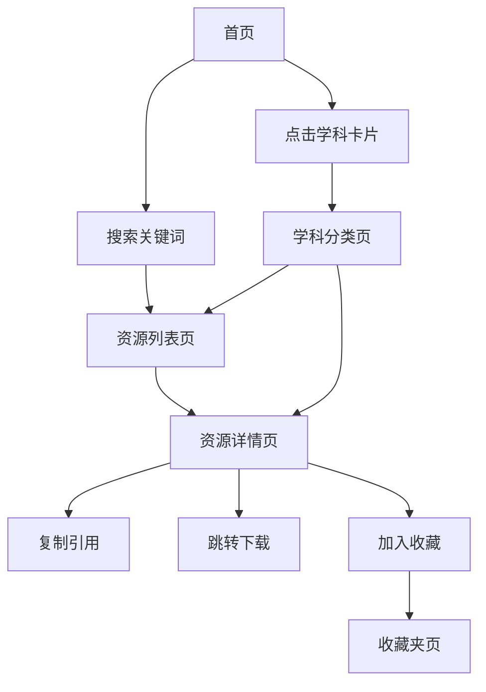

## 1. 产品概述

ScholarHUB 是面向学生与科研小白的开放学术资源聚合检索站，将散落在各论文网站可下载的学术论文、教材、公开数据集，按学科与主题归类整理，一键跳转或下载。无需后端，无需登录，GitHub Pages 静态托管，所有数据以 JSON 形式维护在仓库中，仓库本身即为最终资源下载源。

## 2. 核心功能

### 2.1 角色
本项目无用户体系与登录注册，访问者均为匿名访客。收藏夹通过本地浏览器存储实现，无云端账户。

### 2.2 功能模块
1. **首页**：项目简介、快捷搜索、学科入口、推荐资源。
2. **资源列表页**：按学科 / 主题 / 标签过滤的卡片网格，每张卡片含资源标题、作者、年份、摘要预览、下载/跳转按钮。
3. **资源详情页**：完整摘要、引用格式一键生成（APA / MLA / GB/T 7714）、跳转下载、外部数据库二次搜索、相关推荐。
4. **学科分类页**：可折叠的学科卡片，展开后显示该学科下的所有资源与外部数据库快捷入口。
5. **收藏夹页**：本地浏览器存储的收藏资源，可导出为 JSON。
6. **设置**：深色/浅色模式切换、字体大小、动效开关。

### 2.3 页面详情
| 页面 | 模块 | 描述 |
|---|---|---|
| 首页 | Hero | 项目标语、版本号、搜索框 |
| 首页 | 学科导航 | 6 个一级学科卡片，点击折叠展开 |
| 首页 | 精选资源 | 横向滚动卡片列 |
| 资源列表 | 筛选器 | 学科、类型、年份多选过滤 |
| 资源列表 | 卡片网格 | 资源摘要、标签、下载按钮 |
| 资源详情 | 摘要区 | 标题、作者、年份、期刊、摘要全文 |
| 资源详情 | 操作区 | 跳转下载、跳转 DOI、引用生成、收藏 |
| 资源详情 | 相关推荐 | 同主题 / 同作者的其他资源 |
| 收藏夹 | 列表 | 收藏资源、可批量管理 |
| 设置 | 主题 | 浅色/深色/跟随系统 |
| 设置 | 动效 | 全部开启/减弱/关闭 |

## 3. 核心流程

### 3.1 用户流程
1. 访客从首页进入，看到极简学术风格的入口。
2. 通过顶部搜索栏直接搜索资源标题、作者、关键词；或点击学科卡片进入对应分类。
3. 在资源列表中浏览卡片，点击任意卡片进入详情页查看完整摘要。
4. 在详情页一键复制引用格式，或跳转到原论文网站 / GitHub 仓库文件。
5. 点击"收藏"将资源加入本地收藏夹，随时在收藏夹页查看。

## 4. 用户界面设计

### 4.1 设计风格
- **整体调性**：严谨典雅、简洁唯美，区别于通用 AI 化页面的彩虹渐变与可爱插图，参考《科学美国人》印刷版与 Apple 官网的产品页排版。
- **主色**：墨黑 `#1a1a1a`、纸白 `#f8f6f1`、深灰 `#3c3c3c`。
- **辅色**：墨绿 `#2f4f3a`（用于强调按钮与链接）、赭石 `#a86b3c`（用于标签与标签页标记）。
- **字体**：标题用 `Cormorant Garamond`（衬线、典雅），正文用 `EB Garamond`，等宽用 `JetBrains Mono`，中文回退用 `Noto Serif SC`。
- **按钮**：实色矩形 + 极细描边圆角 `2px`，无阴影，hover 时背景从纸白变淡灰。
- **布局**：以"留白 + 卡片折叠"为主，所有信息默认折叠隐藏；展开动效使用 0.25s 缓动。
- **图标**：使用 `lucide-react` 极细线性图标，1.25px 描边。
- **动效**：仅在卡片展开、页面切换、收藏动作处加 0.25s-0.4s 缓动，不出现弹跳或旋转等夸张效果；可由用户在设置中减弱。

### 4.2 页面设计概览
| 页面 | 模块 | UI 元素 |
|---|---|---|
| 首页 | Hero | 顶部一条横线下方是衬线大标题，居中但不对齐网格，下方留 200px 留白 |
| 首页 | 学科卡片 | 6 个并排卡片，hover 时仅显示极淡的下划线，点击后整张卡片向下展开 |
| 资源列表 | 筛选器 | 顶部一行可滚动 chips，激活态用 1px 墨绿描边 |
| 资源列表 | 卡片 | 卡片底色与页面同色，仅靠 1px 浅灰描边区分；hover 时描边变墨黑 |
| 资源详情 | 摘要 | 摘要全文用 18px 衬线，行高 1.8，首行缩进 2em |
| 资源详情 | 引用生成 | 弹出一个极简下拉菜单，列出 4 种格式，点击复制 |
| 收藏夹 | 列表 | 同资源列表卡片样式，标题前加删除按钮 |
| 设置 | 主题 | 单选条，选中态左侧出现 1.5px 墨绿短线 |

### 4.3 响应式
桌面优先，主内容区最大宽 880px，左对齐到网格 1/3 位置。窗口窄于 768px 时切换为单列布局，字体缩放 0.9。

### 4.4 3D 场景
不适用，本项目无 3D 需求。
