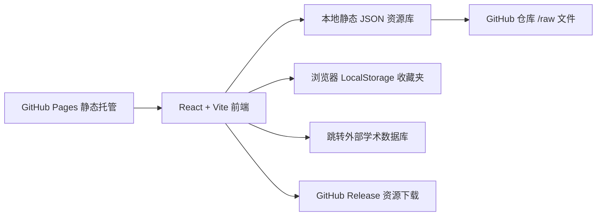
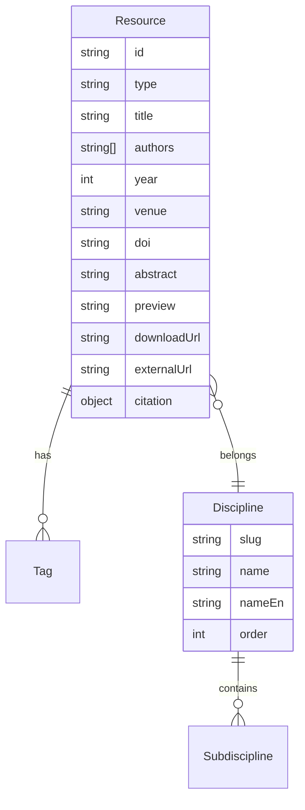

## 1. 架构设计



## 2. 技术栈

- **前端框架**：React 18 + TypeScript 6
- **构建工具**：Vite 7
- **样式**：Tailwind CSS 3（自定义衬线主题）
- **状态管理**：Zustand
- **路由**：React Router 6
- **图标**：lucide-react
- **字体**：Google Fonts（`Cormorant Garamond` / `EB Garamond` / `Noto Serif SC` / `JetBrains Mono`）
- **后端**：无
- **数据**：仓库内 `public/resources/*.json` + 单独的 `papers.json` / `datasets.json` / `links.json`
- **部署**：GitHub Pages，根路径 `/scholarHUB/`

## 3. 路由定义

| 路由 | 用途 |
|---|---|
| `/` | 首页 |
| `/discipline/:slug` | 学科分类页 |
| `/resources` | 资源列表（按类型过滤） |
| `/resource/:id` | 资源详情页 |
| `/search?q=...` | 搜索结果页 |
| `/favorites` | 收藏夹页 |
| `/settings` | 设置页 |
| `/about` | 关于与贡献指南 |

## 4. API 定义

无后端 API，所有数据通过构建时从 `public/resources/*.json` 加载。

```typescript
type ResourceType = 'paper' | 'dataset' | 'book' | 'tutorial';

interface Resource {
  id: string;
  type: ResourceType;
  title: string;
  authors: string[];
  year: number;
  venue?: string;
  doi?: string;
  discipline: string;        // 一级学科 slug
  subdiscipline?: string;    // 二级学科
  tags: string[];
  abstract: string;          // 摘要全文
  preview: string;           // 200 字以内的预览
  downloadUrl?: string;      // 仓库 /raw 或 release 链接
  externalUrl?: string;      // 原始论文/数据集官网
  citation: {
    apa: string;
    mla: string;
    gbt: string;             // GB/T 7714
    bibtex: string;
  };
  addedAt: string;           // ISO date
}
```

## 5. 服务端架构

不适用，无后端。

## 6. 数据模型

### 6.1 数据模型定义



### 6.2 初始数据

数据通过 `public/resources/seed.json` 维护，结构示例：

```json
[
  {
    "id": "deep-learning-goodfellow-2016",
    "type": "book",
    "title": "Deep Learning",
    "authors": ["Ian Goodfellow", "Yoshua Bengio", "Aaron Courville"],
    "year": 2016,
    "venue": "MIT Press",
    "discipline": "computer-science",
    "subdiscipline": "machine-learning",
    "tags": ["深度学习", "deep learning", "神经网络", "textbook"],
    "abstract": "《Deep Learning》是 MIT Press 于 2016 年出版的深度学习领域经典教材，系统介绍了机器学习与深度学习所需的数学基础、经典模型与前沿进展。",
    "preview": "《Deep Learning》是 MIT Press 于 2016 年出版的深度学习经典教材，系统介绍了机器学习与深度学习所需的数学基础、经典模型与前沿进展。",
    "downloadUrl": "https://github.com/badhope/scholarHUB/raw/main/assets/books/deep-learning-2016.pdf",
    "externalUrl": "https://www.deeplearningbook.org/",
    "citation": {
      "apa": "Goodfellow, I., Bengio, Y., & Courville, A. (2016). Deep Learning. MIT Press.",
      "mla": "Goodfellow, Ian, Yoshua Bengio, and Aaron Courville. Deep Learning. MIT Press, 2016.",
      "gbt": "Goodfellow I, Bengio Y, Courville A. Deep Learning[M]. MIT Press, 2016.",
      "bibtex": "@book{goodfellow2016deep, title={Deep Learning}, author={Goodfellow, Ian and Bengio, Yoshua and Courville, Aaron}, year={2016}, publisher={MIT Press}}"
    },
    "addedAt": "2026-06-11"
  }
]
```

## 7. 部署

1. `npm run build` 产物在 `dist/`。
2. GitHub Actions（已有的 CI）增加 `deploy.yml`，在 main 分支 push 时 `actions/deploy-pages@v4` 部署。
3. 仓库 Settings → Pages → Source 选择 `GitHub Actions`。
